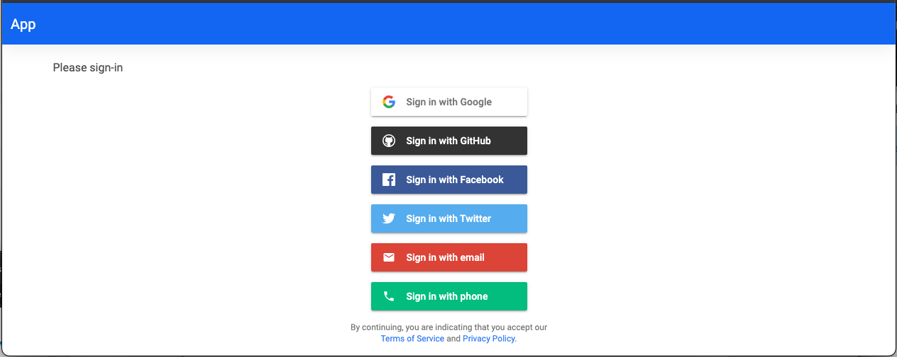
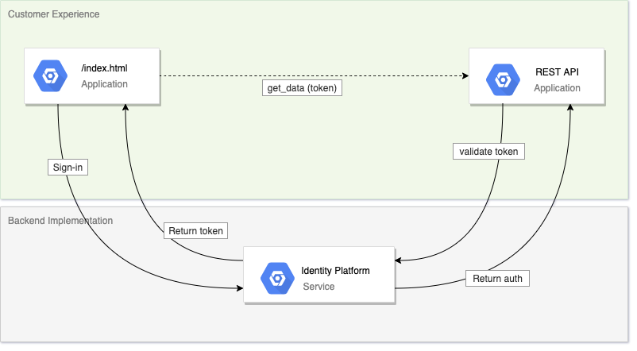

# google_idp
Project contains example(s) for Google Identity Platform (IdP) usage.

The example uses a Flask app API accessing data managed in a database (sqlite). This is under the `main`' branch.

Subsequent branches show changes to the basic app (`main`). Changes are listed below along with the branch that they may be found in. 

### Branches

#### main

- Python Fask app with SQLite access, un-authenticated. The Flask API may be accessed using code, curl, Postman, or other means.

#### gcp-idp-auth

- Google Identity Platform example. FirebaseUI (html) is used to demonstrate user sign-in. Authentication is added to the Flask app. IdP uses the email & password provider. Using the additional providers is possible by adding them in the GCP Identity Platform.
- Changes from main branch.
  - If the user is not signed-in (token is not present), the webpage displays to Firebase UI. On login (token value set) the webpage displays the data content instead of the Firebase UI.
  - REST calls for data retrieval include the user token in the header.
  - The Flask endpoint uses authentication to validate the user token.
- Google Identity Platform is configured to use the username & password, Google, and Github authentication providers. This will need to also be configured within your GCP Identity Platform environment.
- 

### Usage

To view and run any of the branches use the following.

`git clone <branch>`

To run locally, you can optionally use the `run` helper files.

- In the `main` branch optionally use `./run.sh` 
- In the `gap-idp-auth` branch optionally use the files
  - `./backend_run_local.sh` - for the Flask server
  - `./frontend_run_local.sh` - for the index page

### References

- FirebaseUI https://github.com/firebase/firebaseui-web/blob/master/README.md#installation
- Verify OpenID Connect tokens https://google-auth.readthedocs.io/en/latest/reference/google.oauth2.id_token.html
- https://google-auth.readthedocs.io/en/latest/reference/google.oauth2.id_token.html
- https://developers.google.com/identity/protocols/oauth2/web-server#python
